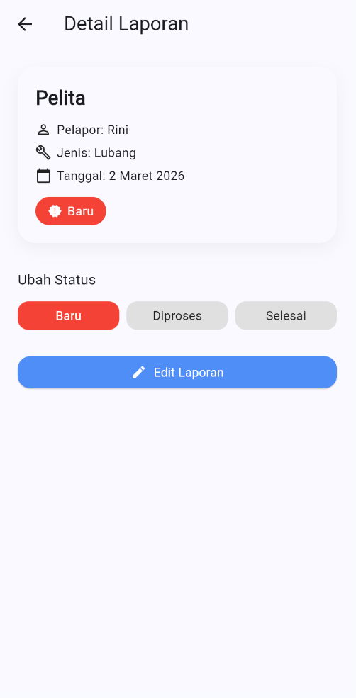
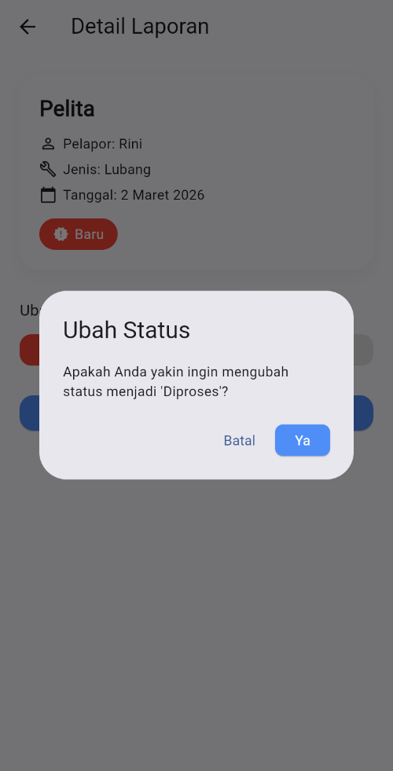
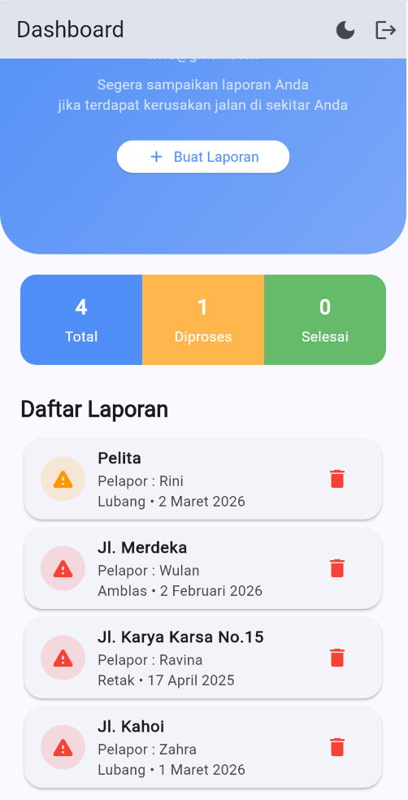
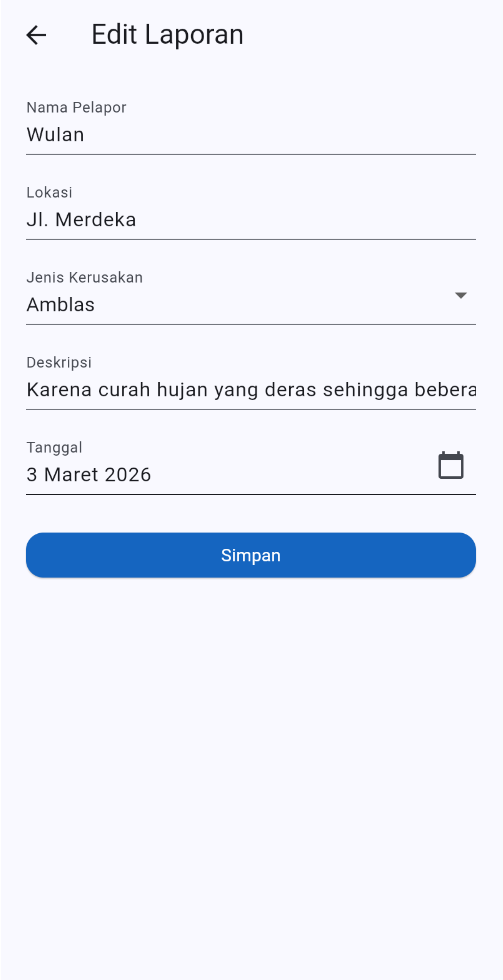
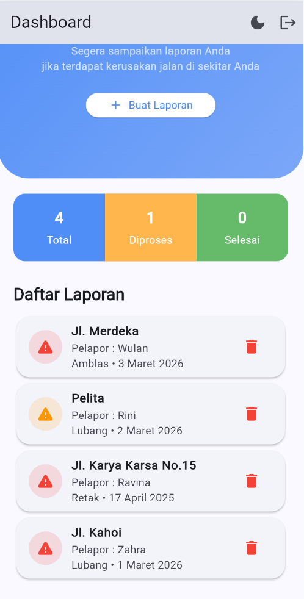
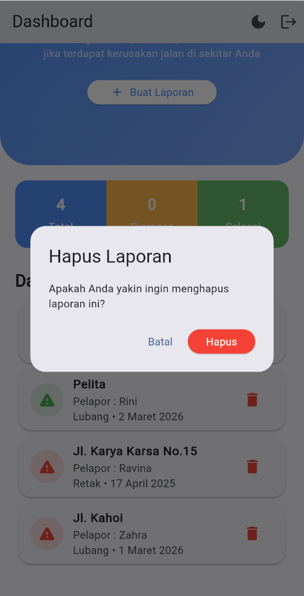
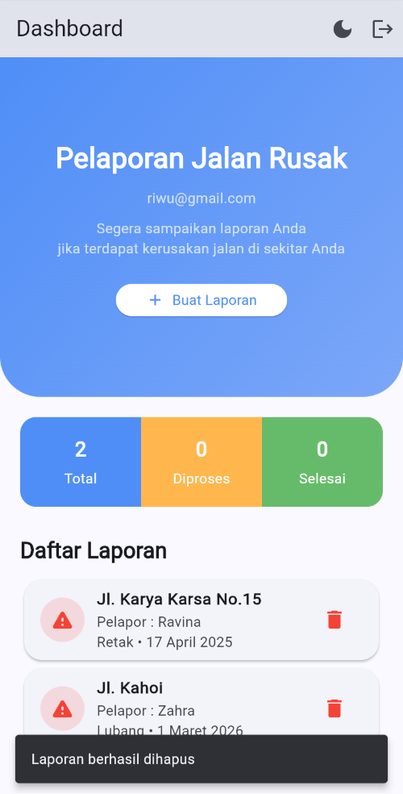

# Minpro2_Pemrograman Aplikasi Bergerak

## Nama: Rini Wulandari

## NIM: 2409116048

## Kelas: Sistem Informasi B 2024

# Aplikasi Manajemen Pelaporan Jalan Rusak
## Deskripsi Aplikasi
Aplikasi Pelaporan Jalan Rusak merupakan aplikasi mobile berbasis Flutter yang dirancang untuk mencatat dan mengelola laporan kerusakan jalan secara sederhana.
Aplikasi ini memungkinkan pengguna untuk:
1.  Menambahkan laporan kerusakan jalan
2.  Melihat daftar laporan
3.  Melihat detail laporan
4.  Mengubah status laporan
5.  Mengedit dan menghapus laporan

## Penjelasan Fitur Aplikasi

### 1. Login
- Fitur Login digunakan agar pengguna bisa masuk ke dalam aplikasi sebelum membuat atau melihat laporan jalan rusak.
- Pada halaman ini, pengguna diminta memasukkan email dan password yang sudah terdaftar. Setelah itu pengguna dapat menekan tombol Login untuk masuk ke aplikasi. Jika data yang dimasukkan benar, pengguna akan diarahkan ke halaman utama aplikasi.
- Selain itu, jika pengguna belum memiliki akun, tersedia pilihan Register untuk membuat akun terlebih dahulu.
- Fitur ini dibuat agar penggunaan aplikasi lebih aman dan setiap laporan dapat diketahui berasal dari pengguna yang terdaftar.

  
  

#
### 2. Register
- Fitur Register digunakan agar pengguna dapat membuat akun baru sebelum menggunakan aplikasi pelaporan jalan rusak.
- Pada halaman ini, pengguna diminta mengisi email, password, dan konfirmasi password untuk memastikan bahwa kata sandi yang dimasukkan sudah benar. Setelah semua data diisi, pengguna dapat menekan tombol Register untuk mendaftarkan akun.
- Jika proses pendaftaran berhasil, pengguna dapat langsung masuk ke aplikasi melalui halaman Login.

  
  

- **User yang melakukan Register dan Login otomatis akan masuk dalam supabase.**

  

#
### 3. HomePage
- Pada halaman Homepage, saya menampilkan tampilan utama aplikasi setelah pengguna berhasil login. Di bagian atas terdapat judul Pelaporan Jalan Rusak yang disertai dengan email pengguna yang sedang digunakan, sehingga pengguna dapat mengetahui akun yang aktif.
- Di bawahnya terdapat deskripsi singkat mengenai tujuan aplikasi serta tombol **Buat Laporan** yang dapat digunakan untuk menambahkan laporan kerusakan jalan baru.
- Selanjutnya, saya menambahkan bagian statistik laporan yang menampilkan jumlah laporan berdasarkan statusnya, yaitu Total, Diproses, dan Selesai, sehingga pengguna dapat melihat perkembangan laporan secara cepat.
- Pada bagian bawah terdapat Daftar Laporan (Read) yang menampilkan laporan yang sudah dibuat dalam bentuk card berisi lokasi jalan, nama pelapor, jenis kerusakan, dan tanggal laporan, serta ikon hapus yang memungkinkan pengguna menghapus laporan jika diperlukan.

  

**Seluruh laporan yang dibuat otomatis akan masuk dalam supabase.**

  

#
### 3. FormPage
- Pada halaman ini saya menyediakan form yang digunakan pengguna untuk memasukkan data terkait kerusakan jalan yang ingin dilaporkan.
- Pengguna diminta mengisi beberapa informasi seperti nama pelapor, lokasi jalan, jenis kerusakan, deskripsi kerusakan, dan tanggal kejadian.
- Untuk jenis kerusakan, pengguna dapat memilih dari beberapa opsi yang tersedia melalui dropdown, sedangkan untuk tanggal disediakan fitur pemilihan tanggal (date picker) agar pengguna dapat memilih tanggal dengan lebih mudah dan formatnya tetap konsisten.
- Setelah semua data diisi, pengguna dapat menekan tombol Simpan untuk menambahkan laporan tersebut ke dalam daftar laporan pada halaman dashboard.
- Setelah berhasil disimpan, data laporan akan langsung muncul pada daftar laporan dan jumlah total laporan juga akan bertambah pada bagian statistik.

  
  
  
  

**Validasi setiap TextField tidak boleh kosong dan harus diisi**

  

#
### 4. DetailPage
- Pada halaman Detail Laporan, saya menampilkan informasi lengkap dari laporan yang telah dibuat oleh pengguna.
- Pada bagian atas ditampilkan nama lokasi jalan, kemudian diikuti dengan informasi nama pelapor, jenis kerusakan, dan tanggal laporan agar pengguna dapat melihat detail laporan dengan jelas.
- Di bawahnya terdapat status laporan yang menunjukkan kondisi laporan saat ini, misalnya Baru, Diproses, atau Selesai. Pengguna juga dapat mengubah status laporan melalui tombol yang tersedia pada bagian Ubah Status.
- Ketika salah satu status dipilih, sistem akan menampilkan dialog konfirmasi terlebih dahulu untuk memastikan perubahan yang dilakukan memang diinginkan oleh pengguna.
- Selain itu, terdapat tombol Edit Laporan yang dapat digunakan untuk memperbarui data laporan jika terdapat informasi yang perlu diperbaiki.
- Setelah status berhasil diubah, perubahan tersebut akan langsung terlihat pada halaman dashboard dan jumlah laporan pada bagian statistik juga akan ikut diperbarui.

  
  
  

#
### 5. Mengedit Laporan
- Saya juga menyediakan form yang digunakan untuk memperbarui data laporan yang sudah dibuat sebelumnya. Data laporan yang telah ada seperti nama pelapor, lokasi, jenis kerusakan, deskripsi, dan tanggal akan otomatis terisi di dalam form sehingga pengguna hanya perlu mengubah bagian yang ingin diperbaiki.
- Pengguna juga tetap dapat mengganti jenis kerusakan melalui dropdown serta memilih tanggal menggunakan fitur pemilihan tanggal. Setelah perubahan selesai dilakukan, pengguna dapat menekan tombol Simpan untuk menyimpan pembaruan data.

  

**Setelah disimpan, informasi laporan yang telah diperbarui akan langsung terlihat pada halaman dashboard maupun detail laporan.**

Sebagai contoh, saya melakukan perubahan tanggal laporan atas nama Wulan yang sebelumnya pada tanggal 2 Februari 2026 diubah menjadi tanggal 3 Maret 2026.

  
  

### 6. Menghapus Laporan
- Untuk menghapus laporan bisa langsung klik ikon tempat sampah berwarna merah pada sebelah kanan laporan, setelah diklik akan muncul konfirmasi untuk memastikan bahwa pengguna benar-benar ingin menghapus data yang dipilih.
- Terdapat dua pilihan tombol, yaitu Batal untuk membatalkan proses dan kembali ke halaman sebelumnya, serta Hapus untuk melanjutkan penghapusan. Jika pengguna memilih Hapus, data akan dihapus dari daftar laporan dan tampilan akan diperbarui secara otomatis.
- Setelah laporan dihapus di bagian bawah layar muncul notifikasi berupa SnackBar dengan pesan “Laporan berhasil dihapus” sebagai bentuk umpan balik kepada pengguna bahwa proses penghapusan telah berhasil dilakukan.

  
  

## Dark Mode
