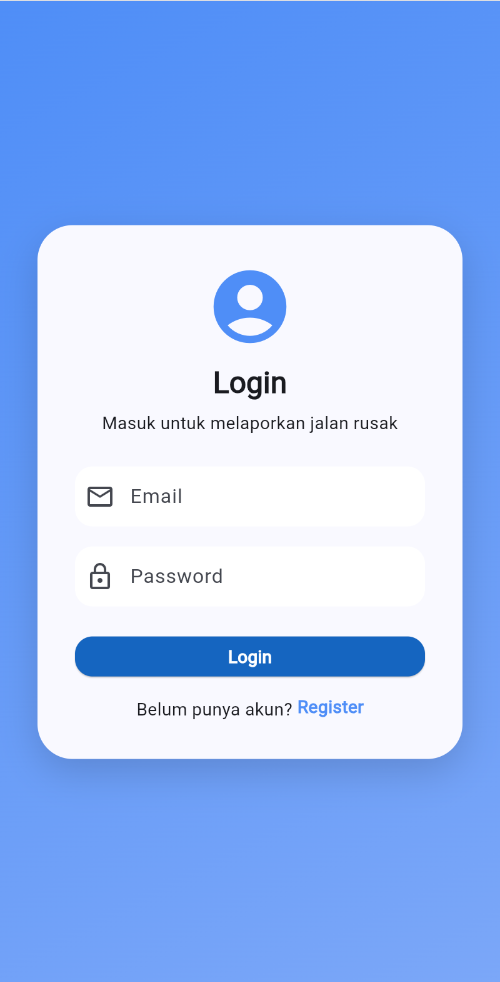
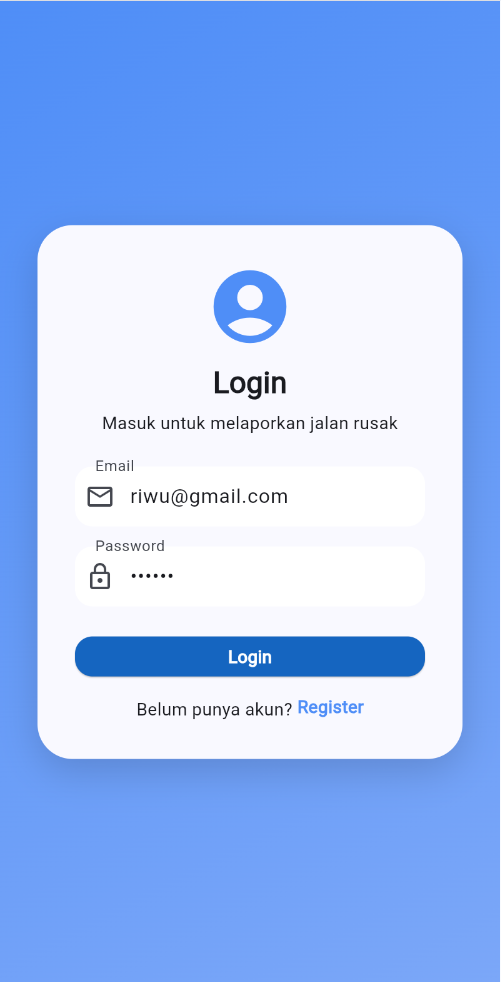
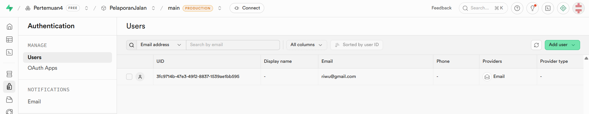
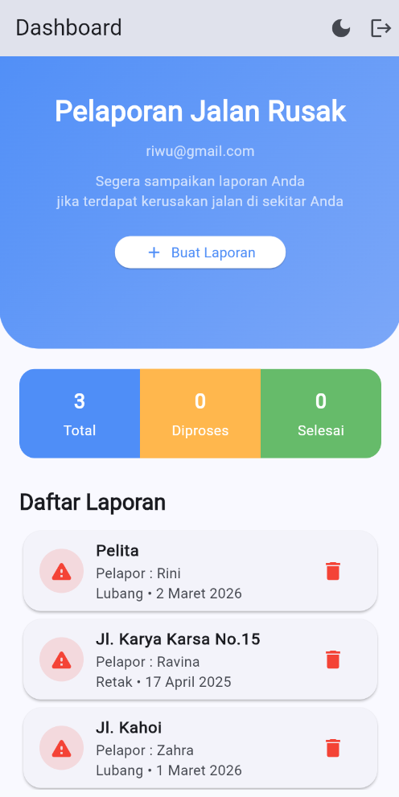
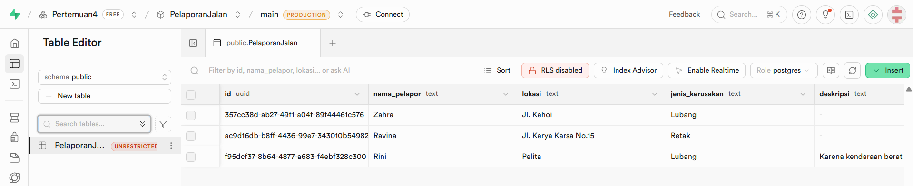
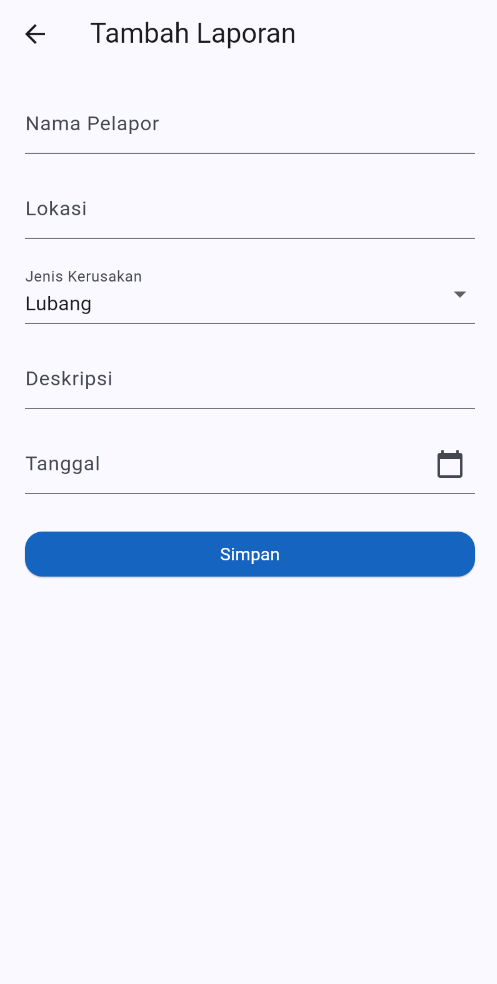
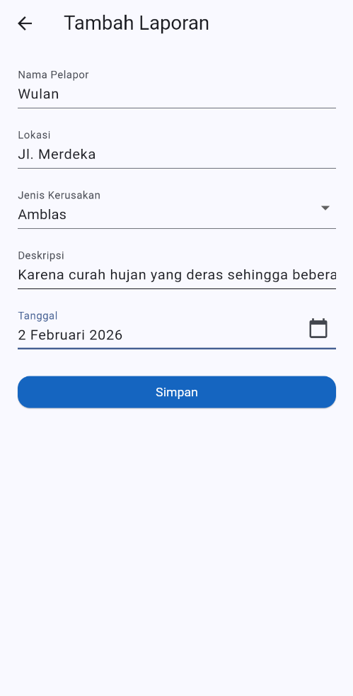
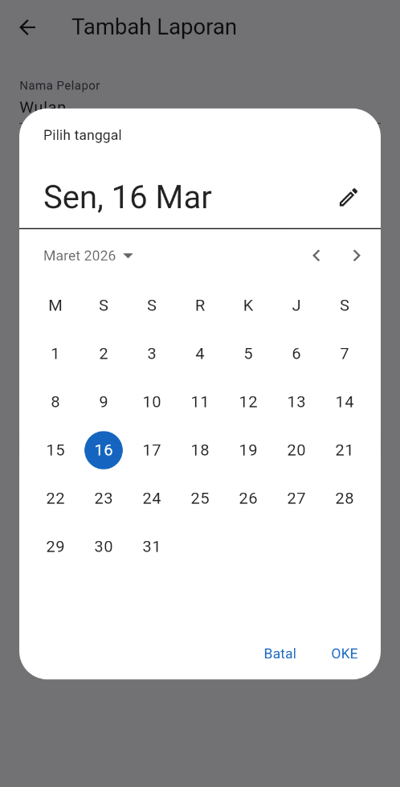
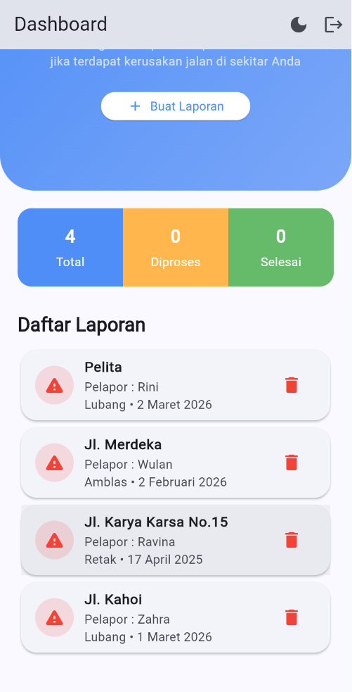
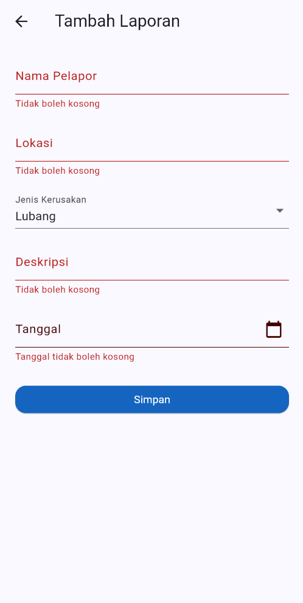

# Minpro2_Pemrograman Aplikasi Bergerak

## Nama: Rini Wulandari

## NIM: 2409116048

## Kelas: Sistem Informasi B 2024

# Aplikasi Manajemen Pelaporan Jalan Rusak
## Deskripsi Aplikasi
Aplikasi Pelaporan Jalan Rusak merupakan aplikasi mobile berbasis Flutter yang dirancang untuk mencatat dan mengelola laporan kerusakan jalan secara sederhana.
Aplikasi ini memungkinkan pengguna untuk:
1.  Menambahkan laporan kerusakan jalan
2.  Melihat daftar laporan
3.  Melihat detail laporan
4.  Mengubah status laporan
5.  Mengedit dan menghapus laporan

## Penjelasan Fitur Aplikasi

### 1. Login
- Fitur Login digunakan agar pengguna bisa masuk ke dalam aplikasi sebelum membuat atau melihat laporan jalan rusak.
- Pada halaman ini, pengguna diminta memasukkan email dan password yang sudah terdaftar. Setelah itu pengguna dapat menekan tombol Login untuk masuk ke aplikasi. Jika data yang dimasukkan benar, pengguna akan diarahkan ke halaman utama aplikasi.
- Selain itu, jika pengguna belum memiliki akun, tersedia pilihan Register untuk membuat akun terlebih dahulu.
- Fitur ini dibuat agar penggunaan aplikasi lebih aman dan setiap laporan dapat diketahui berasal dari pengguna yang terdaftar.

  
  

### 2. Register
- Fitur Register digunakan agar pengguna dapat membuat akun baru sebelum menggunakan aplikasi pelaporan jalan rusak.
- Pada halaman ini, pengguna diminta mengisi email, password, dan konfirmasi password untuk memastikan bahwa kata sandi yang dimasukkan sudah benar. Setelah semua data diisi, pengguna dapat menekan tombol Register untuk mendaftarkan akun.
- Jika proses pendaftaran berhasil, pengguna dapat langsung masuk ke aplikasi melalui halaman Login.

  
  

- **User yang melakukan Register dan Login otomatis akan masuk dalam supabase.**

  

### 3. HomePage
- Pada halaman Homepage, saya menampilkan tampilan utama aplikasi setelah pengguna berhasil login. Di bagian atas terdapat judul Pelaporan Jalan Rusak yang disertai dengan email pengguna yang sedang digunakan, sehingga pengguna dapat mengetahui akun yang aktif.
- Di bawahnya terdapat deskripsi singkat mengenai tujuan aplikasi serta tombol **Buat Laporan** yang dapat digunakan untuk menambahkan laporan kerusakan jalan baru.
- Selanjutnya, saya menambahkan bagian statistik laporan yang menampilkan jumlah laporan berdasarkan statusnya, yaitu Total, Diproses, dan Selesai, sehingga pengguna dapat melihat perkembangan laporan secara cepat.
- Pada bagian bawah terdapat Daftar Laporan yang menampilkan laporan yang sudah dibuat dalam bentuk card berisi lokasi jalan, nama pelapor, jenis kerusakan, dan tanggal laporan, serta ikon hapus yang memungkinkan pengguna menghapus laporan jika diperlukan.

  

- **Seluruh laporan yang dibuat otomatis akan masuk dalam supabase.**

  

### 3. FormPage
- Pada halaman ini saya menyediakan form yang digunakan pengguna untuk memasukkan data terkait kerusakan jalan yang ingin dilaporkan.
- Pengguna diminta mengisi beberapa informasi seperti nama pelapor, lokasi jalan, jenis kerusakan, deskripsi kerusakan, dan tanggal kejadian.
- Untuk jenis kerusakan, pengguna dapat memilih dari beberapa opsi yang tersedia melalui dropdown, sedangkan untuk tanggal disediakan fitur pemilihan tanggal (date picker) agar pengguna dapat memilih tanggal dengan lebih mudah dan formatnya tetap konsisten.
- Setelah semua data diisi, pengguna dapat menekan tombol Simpan untuk menambahkan laporan tersebut ke dalam daftar laporan pada halaman dashboard.
- Setelah berhasil disimpan, data laporan akan langsung muncul pada daftar laporan dan jumlah total laporan juga akan bertambah pada bagian statistik.

  
  
  
  

- **Validasi setiap TextField tidak boleh kosong dan harus diisi**

  

